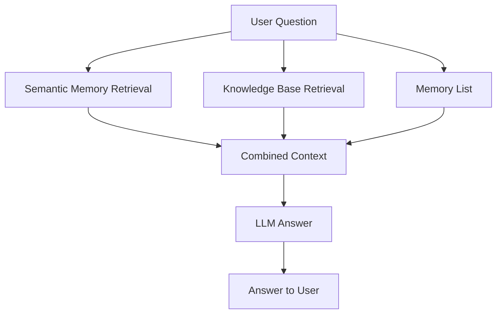
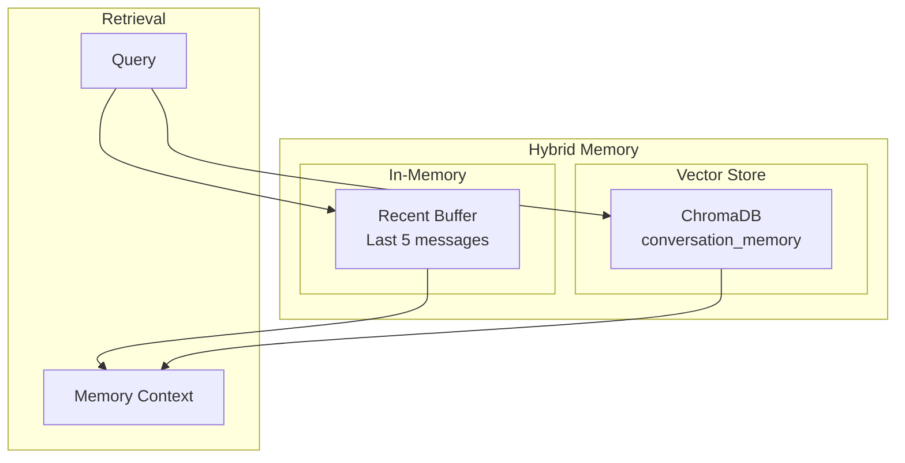
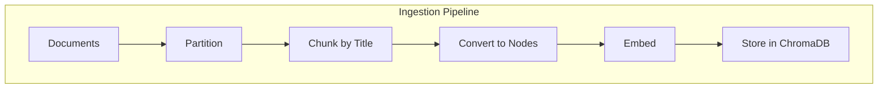

# Session Memory Q&A Agent

A RAG-powered Q&A system with persistent session memory. Answers questions using a knowledge base while retaining context across conversation turns.

## Features

- **Session Memory**: Hybrid memory combining recent message buffer + semantic search
- **RAG Retrieval**: Vector search with MMR (Maximal Marginal Relevance)
- **Google GenAI**: Gemini 3.1 Flash Lite for LLM, Gemini Embedding 001 for embeddings
- **Graceful Error Handling**: Exponential backoff retry on service unavailability

## Tech Stack

| Component | Technology |
|----------|-----------|
| Framework | LlamaIndex |
| Vector DB | ChromaDB |
| Embeddings | Google GenAI (gemini-embedding-001) |
| LLM | Google GenAI (gemini-3.1-flash-lite-preview) |
| Memory | Hybrid (in-memory buffer + ChromaDB semantic search) |

## Project Structure

```
STUDY-RAG-QnA-agent/
├── src/
│   ├── agent/
│   │   ├── qa.py           # RAG retrieval + LLM answer generation
│   │   └── memory.py       # Hybrid conversation memory
│   ├── ingest/
│   │   └── text_loader.py # Document loading
│   └── pipeline/
│       └── index_builder.py # ChromaDB index management
├── data/
│   ├── input/             # Source documents (.txt, .md)
│   └── chroma_db/         # ChromaDB storage (auto-created)
├── config.py              # Configuration
├── ingestion.py           # Build/rebuild index
├── query.py               # Interactive Q&A
├── diagnose.py           # Inspect ChromaDB state
└── requirements.txt       # Python dependencies
```

---

## Table of Contents

- [Quick Start](#quick-start)
- [Architecture](#architecture)
- [Storage](#storage)
- [Configuration](#configuration)
- [User Guide](#user-guide)
- [Troubleshooting](#troubleshooting)
- [Development](#development)

---

## Quick Start

### 1. Prerequisites

**Google API Key**
```bash
export GOOGLE_API_KEY="your-api-key-here"
# Windows PowerShell:
# $env:GOOGLE_API_KEY = "your-api-key-here"
```

**Python Dependencies**
```bash
python -m venv .venv
source .venv/scripts/activate  # Linux/Mac
# .venv\Scripts\activate   # Windows
pip install -r requirements.txt
```

### 2. Add Documents

Place `.txt` or `.md` files in `data/input/`:

```
data/input/
├── getting-started.md
├── billing-faq.md
└── integrations.md
```

### 3. Build the Index

```bash
python ingestion.py
```

> **WARNING**: `ingestion.py` rebuilds the index from scratch on each run. Previous vector embeddings are deleted. This is intentional for keeping the knowledge base fresh during prototype phase.

### 4. Ask Questions

```bash
python query.py
```

Type your question and press Enter. Type `quit` to exit.

---

## Architecture

### Query Pipeline



1. **Semantic Memory Retrieval**: Get conversation history relevant to current question semantically from Chroma
2. **Knowledge Base Retrieval**: Find document chunks most relevant to question semantically from Chroma
3. **Memory List**: a in memory list that stores most  recent messages for context.  
4. **Combined Context**: Merge memory from vector and in-memory list + document context (knowledge base)
5. **LLM Answer**: Generate natural language answer

### Memory Architecture



**Memory Retrieval Strategy:**

1. **Recent Buffer** (guaranteed recency)
   - Last 5 messages stored in-memory
   - Always included in context
   - Ensures LLM never loses immediate conversation thread

2. **Semantic Search** (relevant context)
   - All messages embedded in ChromaDB
   - Vector similarity retrieves past context
   - Deduplicated against recent buffer

### Document Ingestion



1. **Partition**: Extract elements (paragraphs, tables, lists) using Unstructured.io
2. **Chunk**: Group by title sections (keeps Q&A pairs together)
3. **Embed**: Generate vector embeddings with Gemini
4. **Store**: Save in ChromaDB for retrieval

---

## Storage

### ChromaDB Collections

ChromaDB stores two separate collections in `./data/chroma_db/`:

| Collection | Purpose | Contents |
|------------|---------|---------|
| `qna_docs` | Knowledge Base | Embedded document chunks |
| `conversation_memory` | Session Memory | Embedded conversation messages |

### Physical Storage

```
data/chroma_db/
├── .chroma/              # ChromaDB internal files
├── chroma.sqlite         # Collection metadata
├── {UUID}/             # qna_docs collection data
└── {UUID}/             # conversation_memory collection data
```

> **Note**: Physical folders use UUIDs as names. Use `python diagnose.py` to inspect collections and their UUIDs.

---

## Configuration

All settings in `config.py`:

### Retrieval Settings

| Parameter | Default | Description |
|-----------|---------|------------|
| `TOP_K` | 6 | Chunks returned by retriever |
| `MMR_LAMBDA` | 0.7 | MMR diversity (0=max diversity, 1=max relevance) |

### Memory Settings

| Parameter | Default | Description |
|-----------|---------|------------|
| `MEMORY_TOP_K` | 4 | Vector search results for memory |
| `MEMORY_RECENT_COUNT` | 5 | Recent messages in buffer |
| `MEMORY_TOKEN_LIMIT` | 2000 | Token budget for memory context |

### Storage Settings

| Parameter | Default | Description |
|-----------|---------|------------|
| `CHROMA_INDEX_PATH` | `./data/chroma_db` | Vector index storage |
| `CHROMA_INDEX_COLLECTION` | `qna_docs` | Index collection name |
| `CHROMA_MEMORY_PATH` | `./data/chroma_db` | Memory storage |
| `CHROMA_MEMORY_COLLECTION` | `conversation_memory` | Memory collection name |

### Chunking Settings

| Parameter | Default | Description |
|-----------|---------|------------|
| `CHUNK_MAX_CHARS` | 2000 | Hard ceiling per chunk |
| `CHUNK_SOFT_LIMIT` | 1000 | Preferred split point |
| `CHUNK_MIN_CHARS` | 350 | Merge sections smaller than this |

---

## User Guide

### Adding New Documents

1. Place `.txt` or `.md` files in `data/input/`
2. Run `python ingestion.py`
3. Ask questions with `python query.py`

### Updating Documents

Simply replace or edit files in `data/input/` and run `python ingestion.py` again. The index is rebuilt from scratch.

### Clearing the Index

```bash
# Delete ChromaDB storage
rm -rf data/chroma_db

# Rebuild
python ingestion.py
```

---

## Troubleshooting

### "GOOGLE_API_KEY not set"

```bash
export GOOGLE_API_KEY="your-api-key"
# Windows:
# $env:GOOGLE_API_KEY = "your-api-key"
```

### "Module not found" errors

```bash
source .venv/scripts/activate
pip install -r requirements.txt
```

### Poor answer quality

- Add more relevant documents to `data/input/`
- Tune `TOP_K` (more chunks = more context)
- Tune `CHUNK_MAX_CHARS` (smaller chunks = more focused)

### "Service unavailable" errors

The system automatically retries with exponential backoff (1s, 2s, 4s delays). If the issue persists, wait a moment and try again.

### No relevant chunks found

- Check document content matches your questions
- Verify files are in `data/input/` with correct extensions

---

## Development

### Debug Mode

Enable detailed logging in `config.py`:

```python
DEBUG_LLM = True   # Log LLM prompts and responses
DEBUG_TIMING = True  # Log execution timing
```

### Testing Changes

```bash
# Clear and rebuild
rm -rf data/chroma_db
python ingestion.py

# Test
python query.py
```